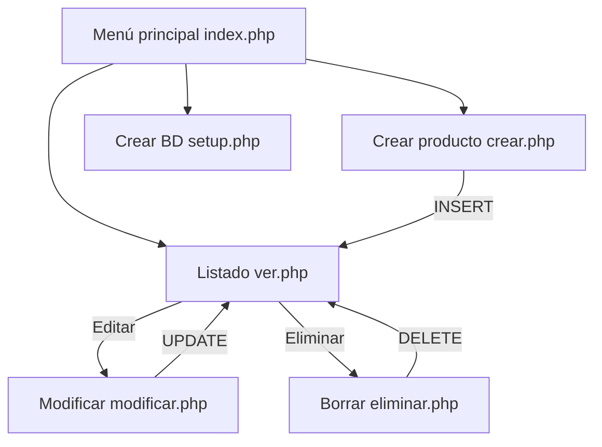

# CRUD Productos — Versión 1

> Sistema de gestión de productos (CRUD) desarrollado en **PHP** con **PDO** y **MariaDB/MySQL**, con una interfaz clara basada en **Bootstrap 5** (barra de navegación superior y tarjetas de acceso).

---

## 1. Descripción del proyecto

Aplicación web de tipo **CRUD** (Crear, Leer, Actualizar, Eliminar) para administrar el inventario de una tienda. Permite:

- Registrar nuevos productos con su descripción y stock disponible.
- Consultar el listado completo de productos.
- Editar los datos de un producto existente.
- Eliminar productos (con confirmación previa).

El proyecto incluye, además, un mecanismo de **creación automática de la base de datos** (archivo `setup.php`): crea la base y la tabla si no existen, sin necesidad de ejecutar SQL a mano.

---

## 2. Tecnologías utilizadas

| Componente | Tecnología |
|---|---|
| Lenguaje | PHP 8 (orientado a objetos, con PDO) |
| Base de datos | MariaDB / MySQL (XAMPP) |
| Acceso a datos | PDO (PHP Data Objects) |
| Frontend | HTML5 + CSS3 + Bootstrap 5.3 |
| Entorno de ejecución | XAMPP (Apache + MySQL) |

---

## 3. Estructura del proyecto

```
crud_v1/
├── index.php        → Menú principal con acceso a las operaciones del CRUD y al setup.
├── setup.php        → Crea la base de datos y la tabla automáticamente (migración básica).
├── tienda.sql       → Script SQL tradicional con la estructura de la base de datos.
├── config.php       → Configuración central de la base de datos (credenciales).
├── conexion.php     → Conexión a la base de datos mediante PDO.
├── crear.php        → Alta (INSERT) de productos.
├── ver.php          → Listado (SELECT) de productos.
├── modificar.php    → Edición (UPDATE) de productos.
├── eliminar.php     → Baja (DELETE) de productos.
└── styles.css       → Estilos propios del proyecto.
```

### Qué hace cada archivo

| Archivo | Función |
|---|---|
| `index.php` | Página de inicio. Presenta tres accesos directos: *Crear producto*, *Ver/Editar* y *Crear BD*. |
| `setup.php` | Conecta al servidor MySQL, crea la base `tienda` y la tabla `productos` si no existen, e inserta un registro de ejemplo cuando la tabla está vacía. |
| `tienda.sql` | Definición SQL clásica de la base y la tabla. Alternativa manual al `setup.php`. |
| `config.php` | Centraliza las credenciales de la base de datos; lo incluyen `conexion.php` y `setup.php` para evitar repetirlas. |
| `conexion.php` | Centraliza la conexión PDO. Configura el modo de errores para lanzar excepciones. |
| `crear.php` | Valida los datos del formulario y ejecuta un `INSERT` con consulta preparada. |
| `ver.php` | Consulta todos los productos y los muestra en una tabla ordenada del más reciente al más antiguo. |
| `modificar.php` | Precarga el formulario con los datos del producto y ejecuta un `UPDATE` al guardar. |
| `eliminar.php` | Elimina un producto únicamente mediante `POST` (nunca por `GET`). |

---

## 4. Base de datos

- **Base de datos:** `tienda`
- **Tabla:** `productos`

### Campos de la tabla `productos`

| Campo | Tipo | Descripción |
|---|---|---|
| `id` | `INT AUTO_INCREMENT` | Clave primaria. |
| `articulo` | `VARCHAR(50) NOT NULL` | Nombre del artículo. |
| `descripcion` | `TEXT NOT NULL` | Descripción del producto. |
| `unidades_disponibles` | `INT NOT NULL DEFAULT 0` | Cantidad de unidades en stock. |

### Formas de crear la base de datos

1. **Automática:** abrir `index.php` y pulsar el botón **"⚙️ Crear BD"**. El archivo `setup.php` se encarga de todo.
2. **Manual:** importar el archivo `tienda.sql` desde phpMyAdmin.

> Nota: `setup.php` y `tienda.sql` definen el mismo esquema. La columna `articulo` es `VARCHAR(50)` en ambos para mantener la consistencia.

---

## 5. Puesta en marcha (XAMPP)

1. Iniciar **Apache** y **MySQL** desde el panel de control de XAMPP.
2. Copiar la carpeta `crud_v1` dentro del directorio `htdocs` de XAMPP.
3. Abrir el navegador y acceder a:

   ```
   http://localhost/crud_v1/
   ```

4. La primera vez, pulsar **"⚙️ Crear BD"** para generar la base de datos y la tabla.
5. A partir de ahí se puede utilizar el CRUD normalmente.

> Si la base de datos ya existe, el `setup.php` la detecta y no duplica nada.

---

## 6. Uso de la aplicación

1. **Crear:** desde el menú principal, ir a *Crear producto*, completar los campos y enviar.
2. **Ver:** acceder al *listado* para consultar todos los productos.
3. **Editar:** pulsar el botón *Editar* sobre el producto deseado, modificar los datos y guardar.
4. **Eliminar:** pulsar *Eliminar* y confirmar la acción en el diálogo de confirmación.

---

## 7. Flujo del CRUD



- **Crear:** formulario → `crear.php` → `INSERT` → vuelve al listado con mensaje de éxito.
- **Leer:** `ver.php` → `SELECT` → tabla con los productos.
- **Actualizar:** `modificar.php?id=N` → `UPDATE` → vuelve al listado.
- **Eliminar:** formulario `POST` en `ver.php` → `eliminar.php` → `DELETE` → vuelve al listado.

---

## 8. Aspectos técnicos y buenas prácticas

- **Consultas preparadas (PDO):** todas las operaciones que reciben datos del usuario utilizan sentencias preparadas con parámetros vinculados, lo que previene la **inyección SQL**.
- **Salida segura:** los valores que provienen de la base de datos se muestran con `htmlspecialchars()` para evitar ataques de tipo **XSS**.
- **Eliminación segura:** el borrado solo se acepta por `POST` y con confirmación en el navegador.
- **Validación de datos:** el formulario de alta valida que el artículo y la descripción no estén vacíos, mostrando mensajes de error claros.
- **Configuración centralizada:** las credenciales están definidas una sola vez en `config.php`, y `conexion.php` y `setup.php` la reutilizan.
- **Modo de errores de PDO:** configurado en `ERRMODE_EXCEPTION` para un manejo controlado de fallos.
- **Separación de responsabilidades:** la conexión está centralizada en `conexion.php` y cada operación del CRUD tiene su propio archivo.

---

## 9. Notas de cátedra (docente de informática)

Este proyecto se plantea como una **práctica integral de programación web** con los siguientes objetivos de aprendizaje:

- Comprender el ciclo completo de un **CRUD** sobre una base de datos relacional.
- Aplicar el patrón **conectar → consultar → renderizar** con la extensión **PDO**.
- Reconocer la diferencia entre métodos HTTP `GET` y `POST` y cuándo corresponde usar cada uno.
- Incorporar buenas prácticas de seguridad básica (consultas preparadas y escape de salida).
- Interpretar un modelo de datos simple: clave primaria, tipos de datos y restricciones `NOT NULL`.
- Utilizar `XAMPP` como entorno integrado de desarrollo y *phpMyAdmin* como herramienta de administración.

**Consigna sugerida de trabajo:** ampliar la tabla `productos` con un nuevo campo (por ejemplo, `precio`) y actualizar el formulario de alta y edición, manteniendo las mismas buenas prácticas ya aplicadas.
